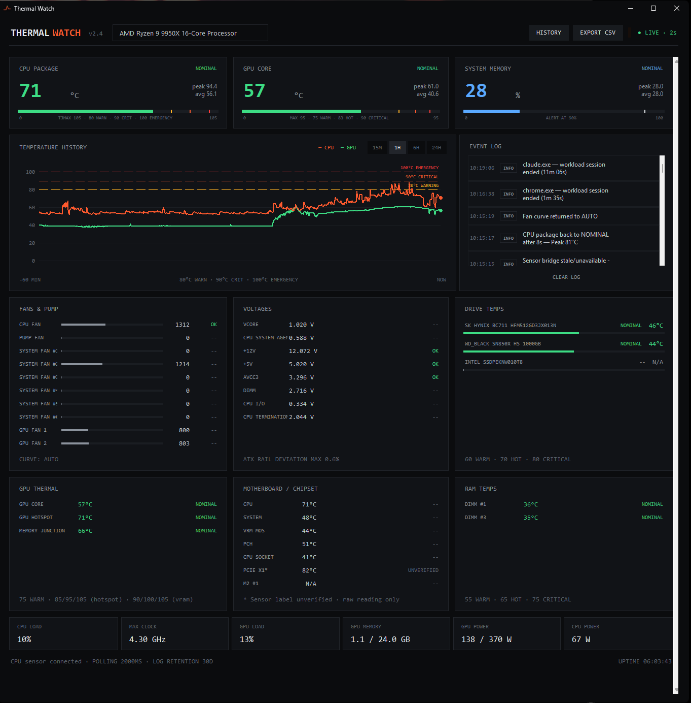
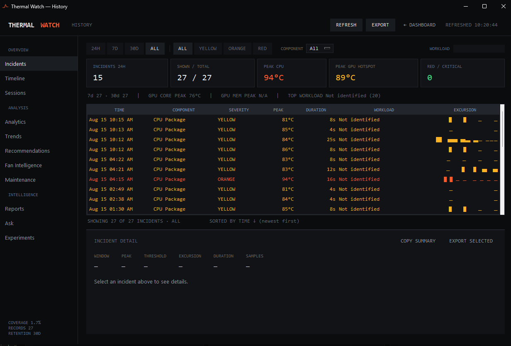
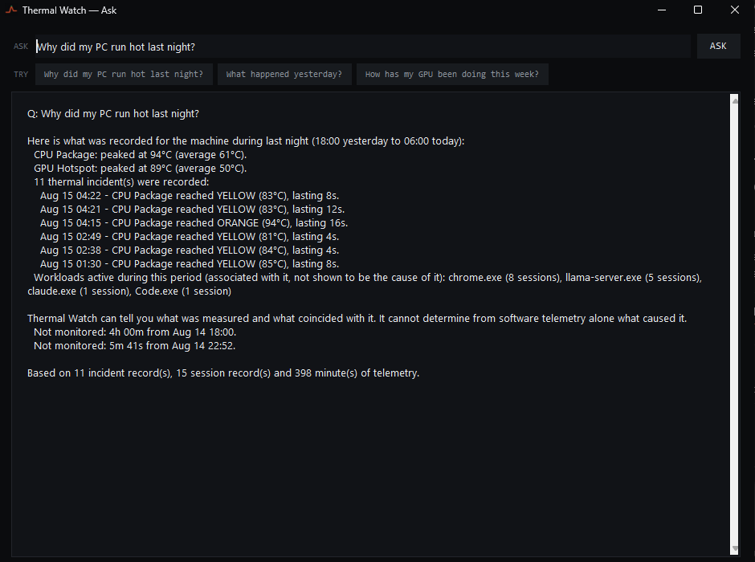

# Thermal Watch

> **Windows hardware monitoring that remembers what happened.**

[](https://github.com/Artha2020/Thermal-Watch/releases/latest)


[](https://github.com/Artha2020/Thermal-Watch/releases)

**Live thermals • Incident history • Workload attribution • Trends • Reports • Evidence-based diagnostics**

## [Download Thermal Watch v1.0.1 for Windows](https://github.com/Artha2020/Thermal-Watch/releases/tag/v1.0.1)

Thermal Watch combines live sensor data with persistent telemetry, incidents, workload sessions, timelines, reports, and trend analysis. It is designed to examine recorded thermal behavior without presenting guesses as measurements.

Version 1.0.1 was developed and validated around the project’s current target PC. Sensor availability and labeling depend on hardware, firmware, drivers, privileges, vendor tools, and LibreHardwareMonitor support; this release does not claim universal hardware compatibility.

## Overview

The main dashboard polls every two seconds and presents live CPU package temperature, GPU core temperature, system memory use, utilization, clocks, power, fans, storage, and additional hardware sensors when the machine exposes them. Thermal Watch records one-minute aggregate telemetry for longer-term analysis while keeping the user interface responsive and the raw monitoring path separate from reporting.

The application is local and dependency-light at runtime. It uses Windows APIs, PowerShell, `nvidia-smi` where available, and the bundled LibreHardwareMonitor library. The elevated sensor bridge is separated from the unprivileged UI process.

## Features

### Live monitoring

- CPU package temperature, utilization, clock, and power where available.
- NVIDIA GPU core temperature, utilization, memory use, clocks, power, and fan percentage through `nvidia-smi`.
- GPU hotspot and memory-junction temperatures when exposed by LibreHardwareMonitor.
- Motherboard and chipset temperatures, DIMM/RAM sensors, HDD/SSD/NVMe temperatures, fan speeds, voltages, controls, clocks, and power sensors when the hardware and sensor backend expose them.
- Live event log, temperature history chart, alert strip, and two-second status updates.
- Sensor identity handling that prefers stable LibreHardwareMonitor identifiers and preserves honest “unverified” labeling for ambiguous sensors.

Missing sensors remain unavailable rather than being synthesized. A value shown on one machine is not evidence that the same sensor exists or is correctly identified on another.

### Thermal zones and incidents

Thermal Watch classifies supported temperature sensors into severity zones with component-specific thresholds. Zone transitions are debounced so a single noisy sample does not immediately become an incident.

An incident records the observed component, sensor identity, start and end times, peak and recovery values, maximum severity, duration, process context, monitoring gaps, and close reason. Active incidents are snapshotted so they can be reconciled after a clean shutdown, crash, or restart. Incident History provides range, component, severity, and workload filtering; incident details; summaries; and CSV or JSON export.

### Workload attribution and sessions

Thermal Watch samples foreground, CPU, and GPU process activity and associates observed workloads with thermal context. Attribution is deliberately non-causal: a process may be reported as dominant or associated with an incident, but the application does not claim that correlation proves the process caused the temperature.

Sustained CPU or GPU activity can form a workload session. Sessions retain duration, observed process IDs, temperature and power aggregates, time in thermal zones, monitoring gaps, and linked incidents. Active sessions are persisted and reconciled across restarts.

### History and analysis

- **Incident History** — filter and inspect recorded thermal episodes, copy summaries, and export selected or filtered records.
- **Timeline** — merge incidents, workload sessions, hardware-change markers, significant log entries, and explicit unmonitored gaps on one chronological view.
- **Application Analytics** — rank workloads using recorded sessions and associated incidents, with per-workload detail.
- **Trend Intelligence** — compare retained periods for workload temperatures, hotspot-to-core deltas, thermal efficiency, idle behavior, incident frequency, and health scores when enough evidence exists.
- **Cooling recommendations** — derive conservative recommendations from repeated recorded patterns rather than one-off spikes.
- **Fan Intelligence** — compare fan levels with observed cooling response using persisted telemetry and minimum sample requirements.
- **Predictive Maintenance** — project observed temperature, health, and incident trends. These are trend projections with confidence and coverage constraints, not hardware-failure predictions.
- **Reports** — generate and retain daily, weekly, and monthly reports for completed periods. Missing reports are generated on the next run, so the PC does not need to be on at the exact period boundary. Reports can be exported as JSON, CSV, or text.
- **Experiments** — mark a hardware or cooling change, such as cleaning, repasting, or adding a fan, then compare retained before/after telemetry and sessions after sufficient time has elapsed. Experiment markers are user-authored annotations; measurements remain sourced from recorded data.
- **Sensor History** — inspect retained history for a selected sensor, including available min/max series and supported comparisons, and export the displayed range as JSON.

### Ask Thermal Watch

Ask Thermal Watch is a deterministic query interface over the application’s recorded evidence; it is not a language model and does not call a hosted AI service. It recognizes questions about status, incidents, timelines, workloads, trends, explanations, and recommendations across periods such as today, yesterday, last night, this week, last month, or a requested number of hours/days/weeks.

Examples include:

- “Why did my PC run hot last night?”
- “What happened yesterday?”
- “Which apps ran hottest in the last 3 days?”
- “Were there any incidents last month?”
- “Is my CPU getting worse over time?”
- “What do you recommend?”

Answers are assembled from telemetry, incidents, sessions, reports, and timeline evidence. Unknown questions receive an explicit limitation instead of a guessed answer.

## Screenshots

### Main dashboard

Live CPU, GPU, memory, cooling, voltage, storage, motherboard, and RAM telemetry from the target system.



### Incident History

Recorded thermal incidents with severity, peak, duration, workload context, filtering, and per-incident evidence.



### Ask Thermal Watch

Deterministic analysis of recorded evidence, including explicit monitoring gaps and non-causal workload language.



See [`docs/screenshots/README.md`](docs/screenshots/README.md) for capture and privacy requirements. These are real windows from the current public build, not design mockups.

## How Thermal Watch Thinks About Evidence

Thermal Watch distinguishes three states that monitoring tools often blur together:

1. **Observed** — a sensor value or process context was actually recorded.
2. **Derived** — a trend, aggregate, score, recommendation, or projection was computed from recorded evidence under explicit minimum-data rules.
3. **Not monitored** — no telemetry exists for that interval.

One-minute telemetry buckets include timestamps and sample counts. Coverage calculations compare recorded buckets with the requested window. Gaps are shown explicitly in timelines, incident/session durability records, reports, and Ask responses. Low-coverage reports and answers carry caveats. Thermal Watch does not fill an offline interval with invented values or claim knowledge about what the hardware did while it was not monitoring.

## Requirements and hardware support

- Windows with PowerShell and Tk support.
- Administrator approval for the sensor bridge when low-level hardware access is needed. The main UI remains unprivileged.
- A supported Python 3 installation for source runs. The v1.0 development build was validated with Python 3.14.
- `nvidia-smi` on `PATH` for NVIDIA-specific metrics. Thermal Watch continues with the sources that remain available if it is absent.
- LibreHardwareMonitor support for the motherboard, CPU, GPU, memory, storage, and controller sensors being queried.

Some sensors require administrator access. Some GPUs do not expose hotspot, memory-junction, or fan data. Fan readings may be RPM or percentage depending on the source. Sensor names and availability can change with firmware, drivers, LibreHardwareMonitor versions, or hardware revisions.

Thermal Watch v1.0 was tested against the project’s current development/target PC and genuine hardware sensors. Other systems should be treated as new validation targets, especially for sensor identity and threshold interpretation.

## Running Thermal Watch

### Packaged application

The PyInstaller onedir build is located at:

```text
dist\ThermalWatch\ThermalWatch.exe
```

Run `ThermalWatch.exe`. The bundle includes `sensor_bridge.ps1`, the application icon, and the LibreHardwareMonitor directory. The executable has no console window. If the privileged bridge is missing or stale, the application can make a rate-limited recovery attempt and may display a UAC prompt.

`dist/` is generated output and is intentionally excluded from Git. Distribute a reviewed build artifact rather than committing the folder to source control.

### Source

From the repository root:

```powershell
cd 'path\to\Thermal-Watch'
.\launch.bat
```

`launch.bat` invokes `launch.ps1`. The launcher starts or reuses the elevated, session-persistent sensor bridge and starts the UI through `pythonw.exe`. Python and `pythonw.exe` must be available on `PATH`.

For an unelevated diagnostic/source run:

```powershell
cd 'path\to\Thermal-Watch'
python .\app.py
```

That path can still provide metrics available without privileged low-level sensor access, but some CPU, motherboard, fan, voltage, or storage sensors may be unavailable.

## Building the Windows executable

PyInstaller is a build-time requirement, not an application runtime dependency. From the repository root:

```powershell
python -m PyInstaller .\ThermalWatch.spec
```

The spec uses repository-relative paths and produces:

```text
dist\ThermalWatch\ThermalWatch.exe
```

The build includes `sensor_bridge.ps1`, `thermal_watch.ico`, and the bundled `LibreHardwareMonitor/` directory. `build/` and `dist/` are ignored generated output. Review the complete distribution, third-party notices, and hardware behavior before publishing a binary.

## Data and privacy

Thermal Watch does not require a cloud account and does not send telemetry to a hosted service. Monitoring data stays in local files beside `app.py` for source runs or beside `ThermalWatch.exe` for frozen runs, unless `THERMAL_WATCH_DATA_DIR` is set before startup.

Persistent stores include:

- `thermal_watch_telemetry.db` — one-minute telemetry aggregates and per-sensor summaries.
- `thermal_watch_reports.db` — generated daily, weekly, and monthly reports.
- `thermal_watch_incidents.jsonl` and `thermal_watch_active_incidents.json`.
- `thermal_watch_sessions.jsonl` and `thermal_watch_active_sessions.json`.
- `thermal_watch_experiments.jsonl` — user-authored hardware-change markers.
- `thermal_watch_events.log`.

The elevated bridge writes current sensor/status snapshots under `%ProgramData%\ThermalWatch`. These files and all application stores are excluded from Git. Exports are created only through user-selected save locations and may contain hardware names, process names, window titles, or workload history; review them before sharing.

Telemetry, incidents, sessions, and event history use a 30-day retention window in v1.0. Reports have their own persistent database.

## Verification and testing

The repository contains 31 feature verification scripts plus `tools/verify_isolation.py`, which runs the complete verification set in redirected temporary data directories and compares production files byte-for-byte before and after the run.

The v1.0 release pass reported:

- 31/31 feature verification scripts passing.
- Verification isolation passing with production data unchanged.
- The packaged executable launching without a console window, reading genuine target-PC sensors, persisting data beside the executable, and shutting down cleanly.

Additional tools cover telemetry/query benchmarks, monitoring overhead, session overhead, bridge resilience, soak analysis, stress workloads, and targeted hardware diagnostics. Several tools are intentionally hardware-specific or operational rather than unit tests; read their module documentation before running them. The isolation gate should not be run while Thermal Watch itself is writing to the production directory.

## Known limitations

- Windows only.
- Hardware coverage depends on Windows APIs, vendor tools, privileges, and LibreHardwareMonitor support.
- v1.0 validation is specific to the current target PC; other hardware requires validation.
- Process/workload attribution describes observed association, not proven causation.
- Trend and maintenance outputs require sufficient retained coverage and cannot reconstruct time when the application was not running.
- Retention limits long-horizon comparisons; old telemetry, incidents, and sessions are pruned.
- Ask Thermal Watch supports a defined deterministic question set rather than open-ended natural-language reasoning.
- Thresholds are monitoring classifications, not replacements for vendor thermal limits, firmware protections, or professional hardware diagnosis.
- The repository currently has no committed real application screenshots.

## License and third-party components

Thermal Watch does not currently include a top-level project license. Until one is added, the repository should not imply that reuse or redistribution rights have been granted for the Thermal Watch source itself.

Thermal Watch bundles **LibreHardwareMonitor 0.9.6** (`LibreHardwareMonitor.exe` and `LibreHardwareMonitorLib.dll`) and its accompanying dependencies. LibreHardwareMonitor is licensed under the **Mozilla Public License 2.0**, while some bundled dependencies use other licenses.

- Project: <https://github.com/LibreHardwareMonitor/LibreHardwareMonitor>
- Bundled notices: [`third_party/THIRD_PARTY_NOTICES.md`](third_party/THIRD_PARTY_NOTICES.md)
- Bundled license texts: [`third_party/licenses/`](third_party/licenses/)
- Upstream license material: <https://github.com/LibreHardwareMonitor/LibreHardwareMonitor/tree/v0.9.6/Licenses>

The Thermal Watch v1.0.1 Windows package includes the applicable bundled third-party notices and license texts under `third_party/`, installed beside the application. Those notices apply only to the identified third-party components and do not grant rights to the Thermal Watch source itself.
